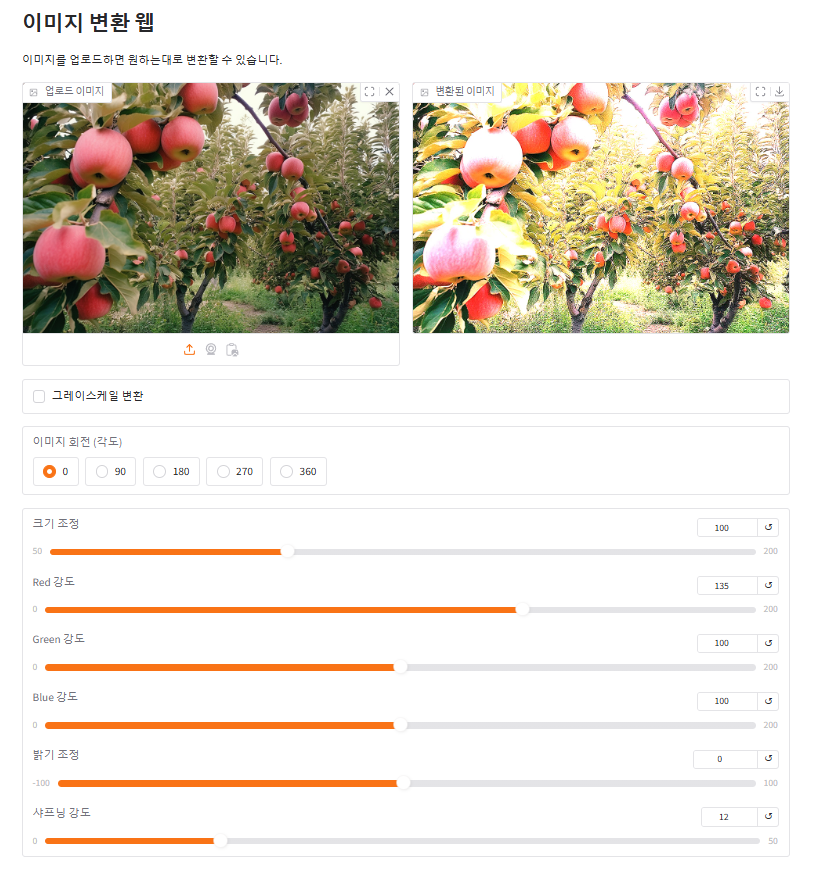
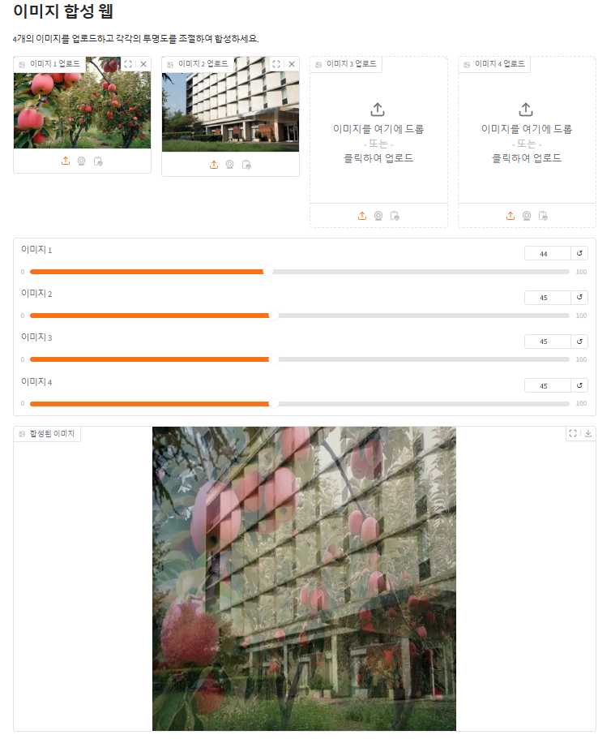

# Gradio

1. `image_control.py`
- 이미지를 업로드하고 그레이스케일 변환, 이미지 회전, 크기 조정, 색상 조정, 밝기 조정, 샤프닝을 트랙바 및 버튼 조정을 통해 실시간으로 반영  
  
<br>
  
2. `image_composition.py`
- 여러 이미지를 업로드하고 각 이미지의 투명도를 설정하여 선택한 알파값에 맞게 합성  

<br><br>

### 실행 방법
- 라이브러리 설치 후 각 파일 실행
```bash
pip install -r requirements.txt
```
```bash
python image_control.py
python image_composition.py
```
<br>  

### 폴더 구조
```plaintext
📁 gradio/
├── 📄 image_control.py         # 이미지 변환
├── 📄 image_composition.py     # 이미지 합성
├── 📄 requirements.txt         # 필요한 라이브러리 목록
└── 📄 README.md                
```