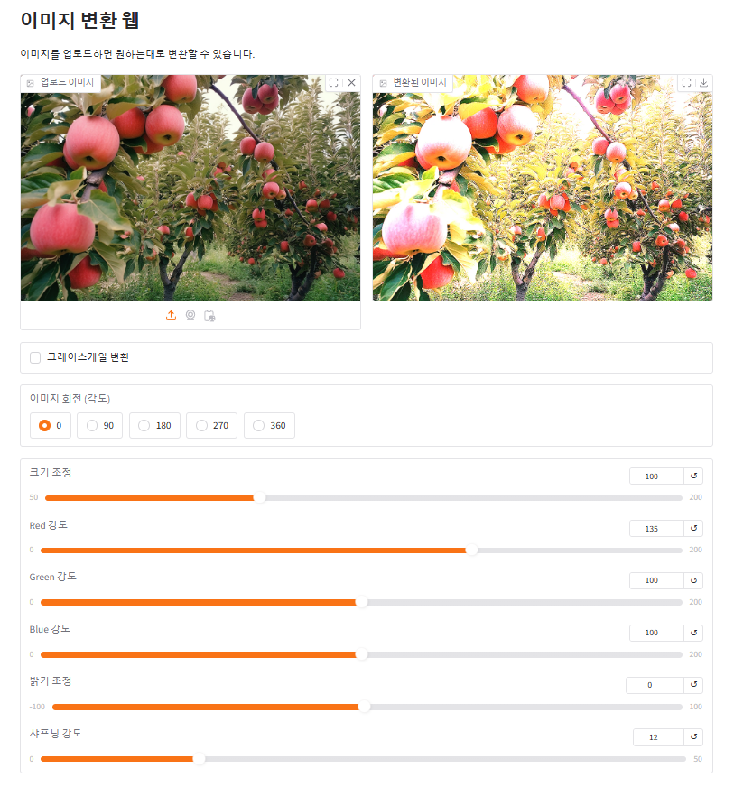
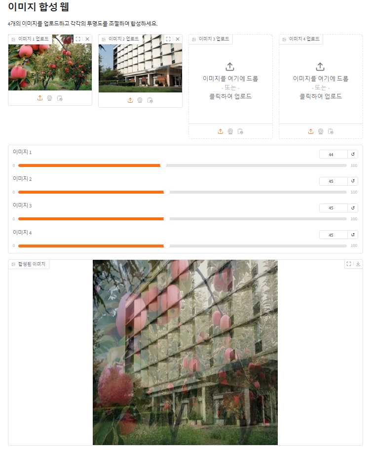
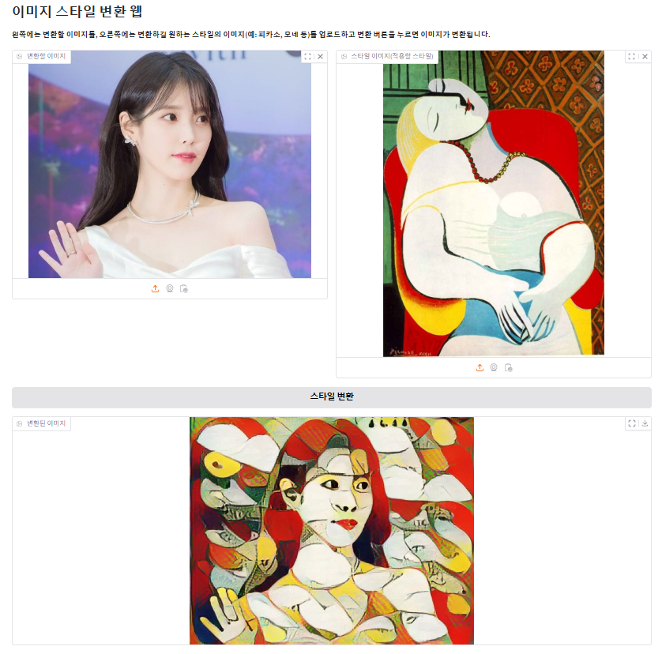
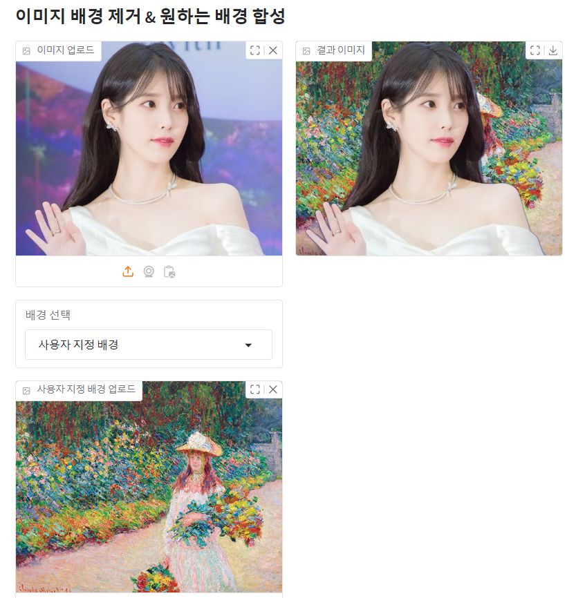

# Gradio-Streamlit

### 1. `image_control.py`
- 이미지를 업로드하고 그레이스케일 변환, 이미지 회전, 크기 조정, 색상 조정, 밝기 조정, 샤프닝을 트랙바 및 버튼 조정을 통해 실시간으로 반영  
  
<br>
  
### 2. `image_composition.py`
- 여러 이미지를 업로드하고 각 이미지의 투명도를 설정하여 선택한 알파값에 맞게 합성  
- 이미지를 NumPy 배열로 변환하여 픽셀 수준의 합성과 투명도 조절
- OpenCV로 이미지의 초기 전처리 및 배열 크기 통일 작업
  
<br>  

### 3. `image_style_transfer.py`
- 변환될 이미지와 적용할 스타일의 이미지, 두 개의 이미지를 업로드하여 사전 학습된 스타일 변환 모델을 사용하여 이미지에 스타일 이미지의 특징을 적용하여 변환
- 사용된 모델 : TensorFlow Hub의 arbitrary-image-stylization-v1-256 모델
  
<br><br>

### 4. `cam_facemask_streamlit.py`
- 웹캠에서 얼굴을 감지하여 드롭다운 메뉴에서 선택한 마스크를 실시간으로 적용
- Mediapipe를 활용하여 얼굴을 실시간으로 감지
- OpenCV로 얼굴 크기와 위치에 따라 마스크 이미지를 조정하고 합성 처리  
<br><br>

### 5. `image_backchange.py`
- 사용자가 이미지를 업로드하면 배경을 제거하고 제공된 배경 또는 사용자가 업로드한 배경 이미지와 합성할 수 있도록 구현
- rembg 라이브러리를 사용하여 입력 이미지에서 배경 제거
  
<br><br>

### 6. `cam_facechange_streamlit.py`
- 웹캠에서 얼굴을 감지하고 두 명 이상일 경우 랜덤으로 얼굴 교체
- Mediapipe FaceMesh를 활용하여 얼굴 윤곽을 감지하고 얼굴 교체를 위한 마스크 생성
- OpenCV의 GaussianBlur를 사용하여 얼굴 합성 시 경계를 부드럽게 처리
- OpenCV의 seamlessClone을 활용하여 얼굴을 자연스럽게 합성
- OpenCV의 addWeighted를 활용하여 얼굴 교체 시 부드러운 전환 효과 적용
<br><br>

### 6-1. `cam_facechange_streamlit_cv.py`
- 웹캠을 통해 실시간으로 얼굴을 감지하고, 두 명 이상일 경우 얼굴을 랜덤으로 교체
- OpenCV의 Haar Cascade(haarcascade_frontalface_default.xml)를 활용한 얼굴 감지 및 교체
- OpenCV의 seamlessClone을 활용하여 얼굴을 자연스럽게 합성
<br><br>

### 7. `cam_face_emotion_stremlit.py`
- 웹캠을 통해 얼굴을 감지하여 실시간으로 감정을 분석하고, 감정에 따라 화면 배경 색상 변경 및 텍스트 제공
- OpenCV의 Haar Cascade(haarcascade_frontalface_default.xml)를 활용한 얼굴 감지 및 감정 분석
- 사용 모델: FER2013 데이터셋을 기반으로 학습된 Mini-Xception 구조의 CNN 모델로, 얼굴 감정을 7가지 클래스(Angry, Disgust, Fear, Happy, Neutral, Sad, Surprise)로 분류. 원래 FER2013 데이터는 48x48이지만, 감정 분석을 위한 입력 전처리 과정에서 크기를 64x64로 변경하여 사용.
- [원본 모델명 : fer2013_mini_XCEPTION.110-0.65.hdf5](https://github.com/oarriaga/face_classification/tree/master/trained_models/emotion_models)
<br><br>


### 실행 방법
- 가상환경 활성화 후 라이브러리 설치 및 각 파일 실행
```bash
# 가상환경 활성화
conda activate <환경 이름>
```
```bash
# 라이브러리 설치
pip install -r requirements.txt
```
```bash
# 파일 실행
python image_control.py
python image_composition.py
python image_style_transfer.py
streamlit run cam_facemask_streamlit.py
python image_backchange.py
streamlit run cam_facechange_streamlit.py
streamlit run cam_facechange_streamlit_cv.py
streamlit run cam_face_emotion_stremlit.py
```
<br>  

### 폴더 구조
```plaintext
📁 GRADIO-STREAMLIT
├── 📁 images                          
│   ├── 📁 mask                         # cam_facemask_streamlit.py 실행에 필요한 이미지
│   └── 📁 web                          # 캡처된 웹 이미지
├── 📁 models
├── 📄 cam_face_emotion_stremlit.py     # 웹캠 얼굴 감정 분류
├── 📄 cam_facemask_streamlit.py        # 웹캠 가면 착용
├── 📄 cam_facechange_streamlit.py      # 웹캠 얼굴 교체1
├── 📄 cam_facechange_streamlit_cv.py   # 웹캠 얼굴 교체2
├── 📄 image_composition.py             # 이미지 합성
├── 📄 image_control.py                 # 이미지 변환
├── 📄 image_style_transfer.py          # 이미지 스타일 적용 변환
├── 📄 image_backchange.py              # 이미지 배경 제거 후 배경 이미지 합성
├── 📄 requirements.txt             
├── 📄 .gitignore              
└── 📄 README.md               
            
```