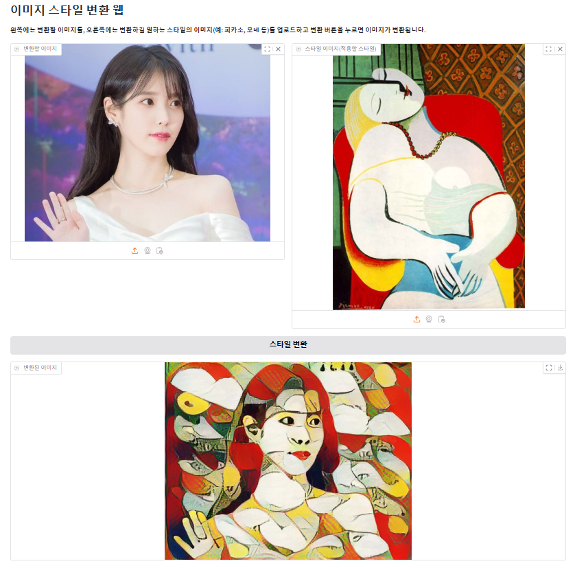

# Gradio-Streamlit

### 1. `image_control.py`
- 이미지를 업로드하고 그레이스케일 변환, 이미지 회전, 크기 조정, 색상 조정, 밝기 조정, 샤프닝을 트랙바 및 버튼 조정을 통해 실시간으로 반영  
  
<br>
  
### 2. `image_composition.py`
- 여러 이미지를 업로드하고 각 이미지의 투명도를 설정하여 선택한 알파값에 맞게 합성  
- 이미지를 NumPy 배열로 변환하여 픽셀 수준의 합성과 투명도 조절
- OpenCV로 이미지의 초기 전처리 및 배열 크기 통일 작업
  
<br>  

### 3. `image_style_transfer.py`
- 변환될 이미지와 적용할 스타일의 이미지, 두 개의 이미지를 업로드하여 사전 학습된 스타일 변환 모델을 사용하여 이미지에 스타일 이미지의 특징을 적용하여 변환
- 사용된 모델 : TensorFlow Hub의 arbitrary-image-stylization-v1-256 모델
  
<br><br>

### 4. `cam_facemask_streamlit.py`
- 웹캠에서 얼굴을 감지하여 드롭다운 메뉴에서 선택한 마스크를 실시간으로 적용
- Mediapipe를 활용하여 얼굴을 실시간으로 감지
- OpenCV로 얼굴 크기와 위치에 따라 마스크 이미지를 조정하고 합성 처리  
<br><br>

### 실행 방법
- 가상환경 활성화 후 라이브러리 설치 및 각 파일 실행
```bash
# 가상환경 활성화
conda activate <환경 이름>
```
```bash
# 라이브러리 설치
pip install -r requirements.txt
```
```bash
# 파일 실행
python image_control.py
python image_composition.py
python image_style_transfer.py
```
<br>  

### 폴더 구조
```plaintext
📁 gradio/
├── 📁 images/                  # 각 파일별 웹 캡처 이미지들
├── 📄 image_control.py         # 이미지 변환
├── 📄 image_composition.py     # 이미지 합성
├── 📄 image_style_transfer.py  # 이미지 스타일 적용 변환
├── 📄 requirements.txt         # 필요한 라이브러리 목록
├── 📄 .gitignore
└── 📄 README.md                
```